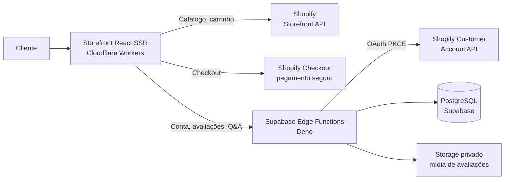
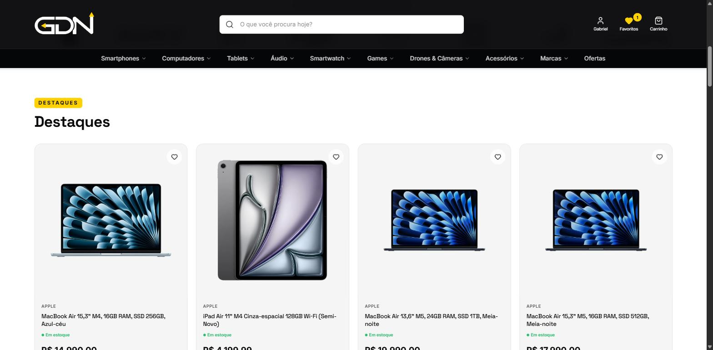
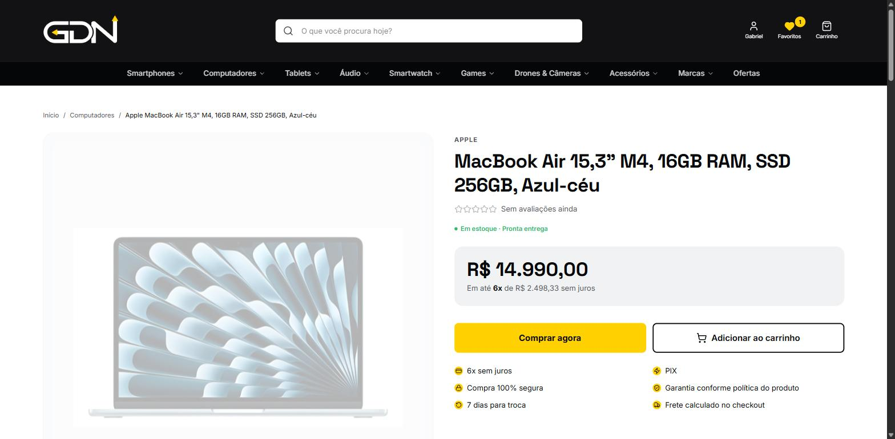
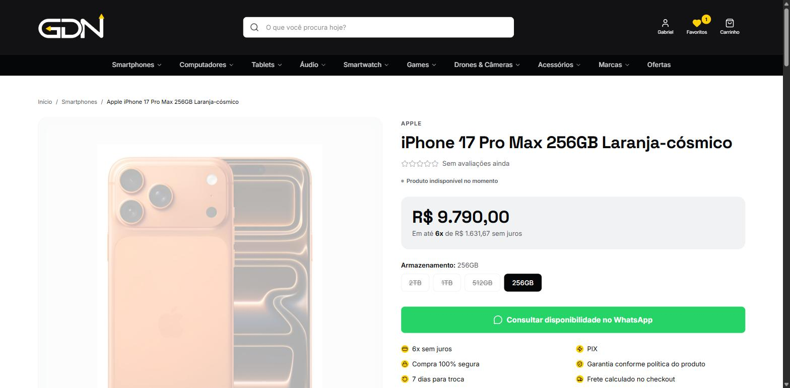
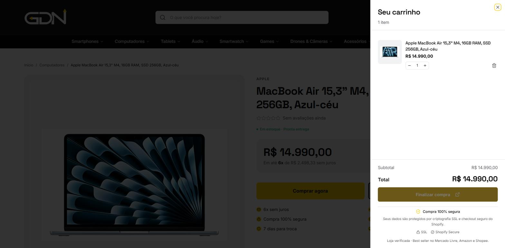
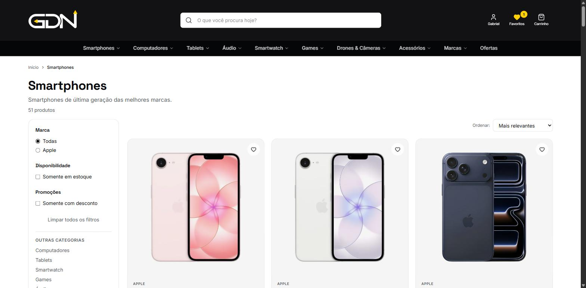

# GDN Store — E-commerce de Tecnologia

**Loja virtual em produção com arquitetura headless: storefront próprio em React + checkout e backoffice Shopify.**

🔗 **Site ao vivo: [gdnstore.com.br](https://gdnstore.com.br)**

---

## Sobre o projeto

A **GDN Store** é uma loja de tecnologia real, em operação (CNPJ 57.767.400/0001-44), especializada em notebooks, smartphones, games e acessórios das principais marcas — Apple, Sony, DJI, Dell, Xiaomi, ASUS ROG e Garmin.

Em vez de usar um tema pronto de plataforma, o projeto adota **arquitetura headless**: a vitrine é uma aplicação própria em React com SSR, enquanto o **Shopify** cuida do que faz melhor — catálogo, estoque, checkout seguro e gestão de pedidos. Entre as duas pontas, uma camada de **Supabase Edge Functions** implementa autenticação de clientes, avaliações verificadas e moderação de conteúdo.

O resultado é uma experiência de compra com identidade visual 100% própria, performance de edge e a segurança de pagamento de uma das maiores plataformas de commerce do mundo.

## Arquitetura

**Divisão de responsabilidades:**

| Camada | Papel |
|---|---|
| **Storefront (React 19 + TanStack Start)** | Vitrine SSR com rotas file-based, data fetching com React Query e estado global com Zustand |
| **Shopify** | Catálogo, variantes, estoque, checkout, pedidos e pagamentos (PIX, cartão em até 6x) |
| **Supabase Edge Functions (Deno)** | Autenticação de clientes, pedidos, avaliações, perguntas & respostas, painel de moderação |
| **PostgreSQL (Supabase)** | Perfis de cliente, sessões, tokens criptografados, avaliações e Q&A |
| **Cloudflare Workers** | Deploy do SSR na edge, com o domínio próprio `gdnstore.com.br` |

## Funcionalidades

### 🛍️ Vitrine
- Home com hero em carrossel, seções de destaques, novidades e banners promocionais
- Navegação por mega menu: categorias, coleções e páginas por marca
- Busca de produtos e filtros por marca, disponibilidade e promoção
- Lista de favoritos (wishlist) persistente
- Página de ofertas e newsletter

### 📦 Página de produto
- Galeria de imagens com zoom
- Seletor de variantes (cor, armazenamento, memória) com preços por variante
- Parcelamento em até 6x sem juros calculado por produto
- Blocos de descrição rica, ficha técnica e destaques do produto
- Produto indisponível? O CTA vira **consulta de disponibilidade via WhatsApp** — nenhuma venda perdida

### 🛒 Carrinho e checkout
- Carrinho em drawer lateral com sincronização de sessão
- Checkout finalizado no **ambiente seguro do Shopify** (SSL, pagamentos criptografados)
- Rastreamento de pedido com código enviado após postagem

### 👤 Conta do cliente
- Login via **Shopify Customer Account API** com OAuth 2.0 + **PKCE (S256)**
- Sessões próprias com tokens opacos e renovação automática do access token
- Histórico de pedidos, edição de perfil e gerenciamento de endereços
- Central do cliente: minhas avaliações e minhas perguntas

### ⭐ Avaliações verificadas
- Sistema de reviews no estilo dos grandes marketplaces: **somente quem comprou (pedido pago, verificado no servidor) pode avaliar**
- Upload de fotos e vídeos via URLs assinadas, em bucket privado
- Nota média, distribuição de estrelas e selo de compra verificada

### ❓ Perguntas & respostas
- Clientes autenticados enviam perguntas na página do produto
- Fila de moderação antes da publicação

### 🛡️ Painel administrativo
- Dashboard de moderação de avaliações e perguntas (aprovar, rejeitar, responder)
- Controle de acesso por papel (admin) validado no servidor a cada ação

## Segurança

- Tokens OAuth armazenados **criptografados** no banco; nunca expostos ao navegador
- Sessões com token opaco + hash no servidor, com expiração e revogação
- Proteção CSRF no fluxo OAuth via state hash de uso único
- Tabelas acessadas exclusivamente por Edge Functions com service role — sem acesso direto do cliente ao banco
- Mídia de avaliações em storage privado, servida por URLs assinadas geradas no servidor
- Checkout e dados de pagamento inteiramente no ambiente PCI-compliant do Shopify

## Screenshots

### Home

### Produto
Produto em estoque, com compra direta e parcelamento:

Produto indisponível, com fallback de atendimento via WhatsApp:

### Carrinho
Drawer de carrinho com envio ao checkout seguro do Shopify:

### Coleção
Listagem com filtros por marca, disponibilidade e promoção:

## Stack técnica

| Categoria | Tecnologias |
|---|---|
| **Framework** | React 19, TanStack Start (SSR), TanStack Router (rotas file-based), TanStack Query |
| **Linguagem** | TypeScript |
| **UI** | Tailwind CSS v4, Radix UI / shadcn-ui, Framer Motion, Embla Carousel, Lucide Icons |
| **Estado & formulários** | Zustand, React Hook Form + Zod |
| **Commerce** | Shopify (Storefront API, Checkout, Customer Account API) |
| **Backend** | Supabase Edge Functions (Deno), PostgreSQL, Supabase Storage |
| **Infra** | Cloudflare Workers (SSR na edge), Vite 7, Nitro |
| **Qualidade** | ESLint, Prettier, TypeScript strict |

## Destaques de engenharia

- **SSR na edge** — a vitrine roda em Cloudflare Workers, com renderização no servidor para SEO e primeira pintura rápida
- **Integração profunda com Shopify sem tema Liquid** — todo o front é próprio; o Shopify entra como plataforma de commerce via APIs
- **Fluxo OAuth completo implementado à mão** (authorization code + PKCE, troca de código por sessão, refresh automático) sobre a Customer Account API
- **UGC com confiança** — avaliações só de compradores reais, verificadas server-side contra os pedidos pagos do Shopify
- **Operação real** — loja ativa com emissão fiscal, presença em Mercado Livre, Amazon e Shopee, e atendimento humano via WhatsApp

## Sobre este repositório

O código-fonte da aplicação fica em repositório privado por conter configuração de produção e dados comerciais da loja. Este repositório documenta a arquitetura e as funcionalidades do projeto.

---

Desenvolvido por **Gabriel Antonio** · [GitHub](https://github.com/Gabrielnasan) · Loja: [gdnstore.com.br](https://gdnstore.com.br)

